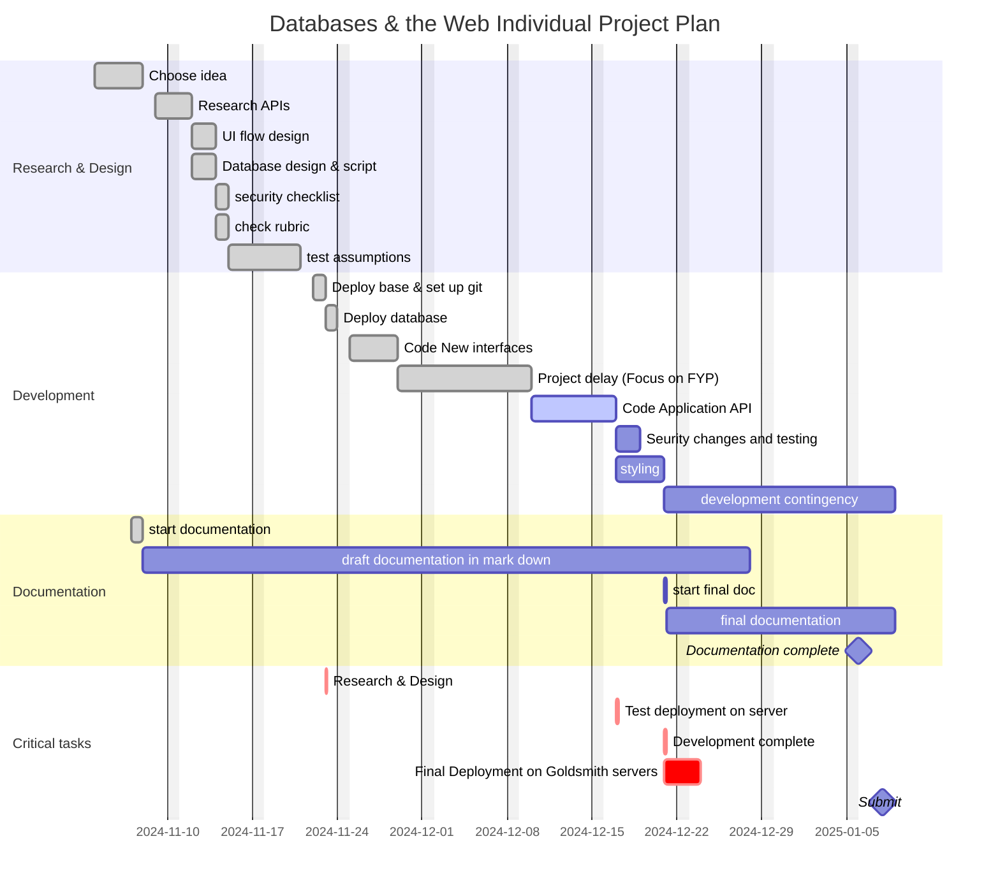
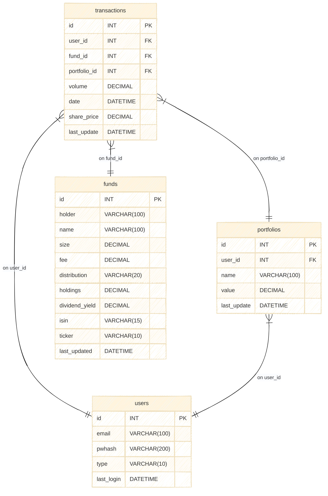
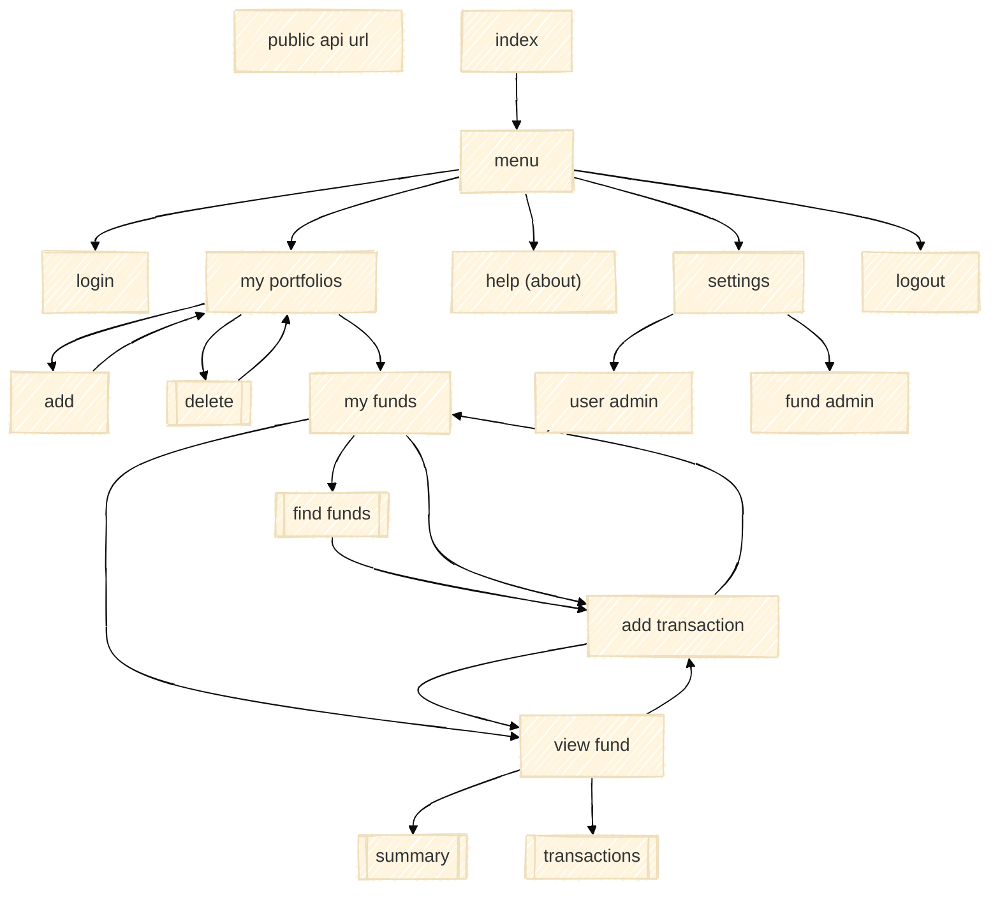

# project plan



## draft data structure



## draft UI flow v1.0




# assumption testing
get some data and see if any of the APIs work

sample data from justetf
```
            isin     fee          size ticker   yahoo                                               Price   More data   Notes   alphaville
0   IE00B6YX5C33  0.0003  1.03   SPY5   https://finance.yahoo.com/quote/SPY5.L/             Yes     Yes         GBP
1   IE00B4K6B022  0.0005  8.96   H50E   https://finance.yahoo.com/quote/IE00B4K6B022.SG/    Yes     No          EUR
2   IE00B60SWX25  0.0005  5.57   SX5S   https://finance.yahoo.com/quote/SC0D.DE/            Yes     No          EUR
3   IE00B5B5TG76  0.0005  1.70   OSX5   https://finance.yahoo.com/quote/S6X0.DE/            Yes     Yes         EUR
4   IE00B60SX170  0.0005  4.72   MXUS   https://finance.yahoo.com/quote/MXUS.L/             Yes     Yes         ???
5   IE00BK5LYT47  0.0005  2.30   MXUD   https://finance.yahoo.com/quote/MXUD.L/             Yes     Yes
```


## yahoo finance, using a rapid api key


## alphaville using an API key that allows 25 queries a day


# Draft Documentation
## Outline [200 words max]
`An outline describing the application you have built (max 200 words)
`

My application is a stock portfolio reporting system.

## Links and Logins
`Links and logins: URL of your deployed, running app; Link to your Github repo; Username / password`

## Architecture [100 max] 
`A high-level architecture including a diagram and description (max 100 words) describing what technologies and components you have used in your application tier and data tier`

- Node.js, 
- express, 
- ejs, 
- bcrypt, 
- css - material from google?
- Hosting, 
- web server (apache?) 
- mysql

## Data Model [100]
`A data model including a diagram and description (max 100 words)`

- User
- Fund
- Transaction
- Portfolio

## User Functionality [500 words max]
`A description of the user-facing functionality of your application, adding screenshots to help explain (max 500 words)`

## Security [500 words max]
`A description of how you have addressed security risks in your application (max 500 words)`

Security checklist
- [ ] Transport SSL
- [X] Passwords bcrypt , passwords complexity
- [ ] API use (api key?), API rate limiting (denial of service?)
- [X] SQL Injection attacks – sanitisation
- [X] Cross Site Scripting – sanitisation
- [ ] Cross Site Request Forgery
- [ ] Content headers - CORS
- [ ] Rate limiting for pages as well
- [ ] zap test? if time

## API Usage
`Details of how to use your API`

## API Provision
## Advanced Techniques [500 words max]
`An optional description of any advanced techniques that you want us to consider as a demonstration of your development skills.  You must include code snippets to illustrate how you have used these techniques and refer to the files that contain that code. (max 500 words)`

